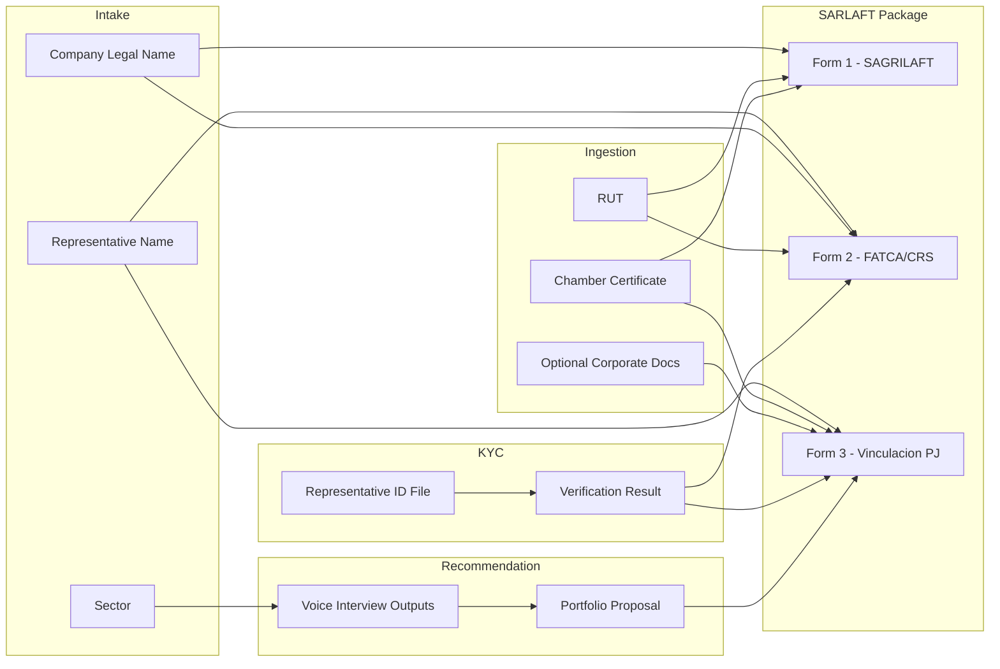

# Current Process Flow (Easy View)

This document explains the current onboarding process using a simple flowchart and a relationship map between data points.

## 1) End-to-End Flow

```mermaid
flowchart TD
    A[Start Up<br/>Welcome + what will happen + docs checklist] --> B[Company Data (PJ)<br/>Legal representative name<br/>Company legal name<br/>Sector]
    B --> C[Corporate Document Ingestion<br/>Pre-message before upload<br/>Grouped sections: Required / Optional<br/>Upload + validation]
    C --> D[KYC - Legal Representative ID<br/>Upload ID copy<br/>Light verification animation]
    D --> E[AI Advisor<br/>Voice interview<br/>Risk/profile signals]
    E --> F[Portfolio Recommendation<br/>Accept recommendation]
    F --> G[SARLAFT Forms Package<br/>Review/edit forms<br/>Generate ZIP/PDF]
    G --> H[Send Documentation / Finalize]
```

## 2) Information Relationship Map



## 3) Practical Mapping (What feeds what)

- `Company Data (PJ)` feeds base legal identity fields in the forms.
- `Corporate Ingestion` provides documentary evidence for company-level compliance fields.
- `KYC` validates who can legally act for the company (representative legal).
- `AI Advisor` produces profile/risk context used by portfolio recommendation.
- `Portfolio Acceptance` unlocks final compliance package review and export.

## 4) Why this map helps

- Makes the process easy to explain to business, product, and compliance teams.
- Shows where each piece of information enters the flow.
- Makes gaps visible (missing docs, missing KYC, missing form fields).
- Helps align demo flows and production flows with the same data relationships.

